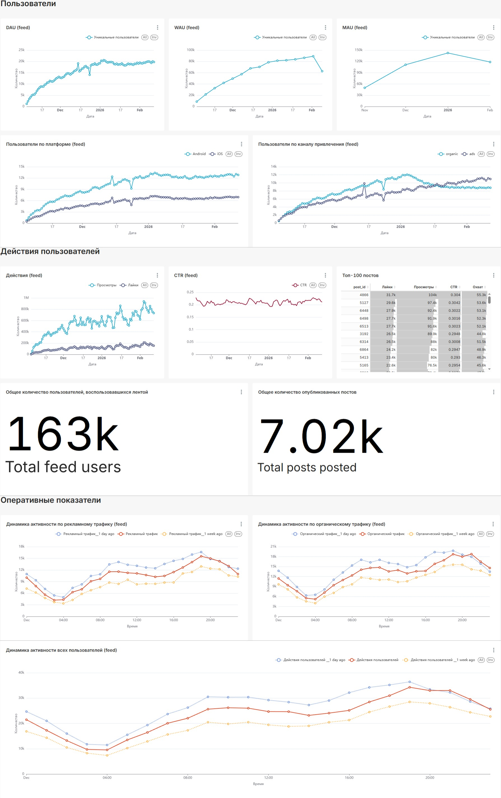
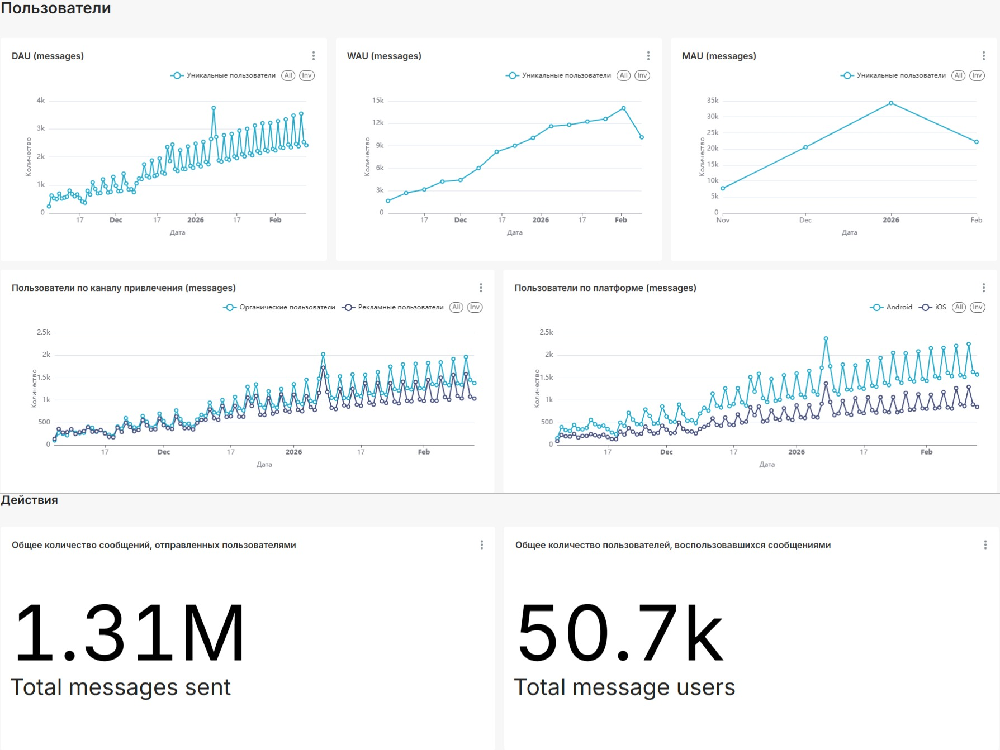
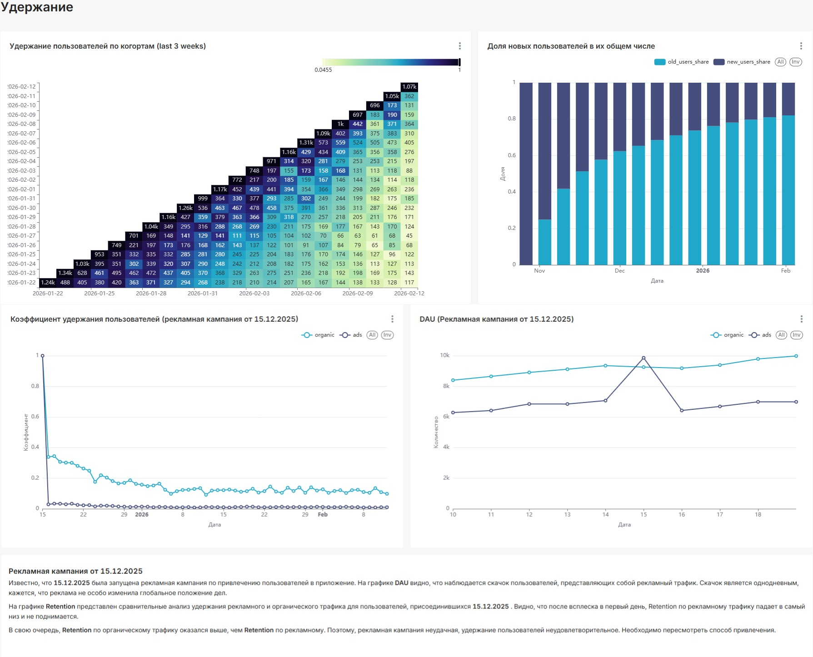

# <b>Разработка дашбордов для социальной сети</b>

Данный проект содержит дашборды, разработанные для отслеживания состояния сервиса через призму активности пользователей. Первый и второй дашборды содержат основные метрики для отслеживания активности и роста активной аудитории в разрезе по сервисам "Новостная лента" и "Мессенджер". Третий дашборд содержит основную информацию по удержанию пользователей, а также анализ последней активной рекламной кампании.

  
  

## <b>Навигация</b>
1. [Описание проекта](#навигация)
2. [Первый дашборд](#первый-дашборд)
3. [Второй дашборд](#второй-дашборд)
4. [Третий дашборд](#третий-дашборд)

## <b>Первый дашборд</b>

Первый дашборд сфокусирован на основных метриках <b>вовлеченности</b> и <b>роста</b> аудитории в ключевом сервисе приложения. Позволяет отслеживать динамику активных пользователей, активность по платформам и каналам привлечения, а также оценивать вовлеченность через просмотры, лайки и CTR контента. Эти метрики позволяют оценить общее здоровье продукта, популярность контента и выявить базовые тренды поведения аудитории в ленте.

  

  Рисунок 1. Первый дашборд

## <b>Второй дашборд</b>

Данный дашборд фокусируется на <b>социальном взаимодействии</b> — использовании мессенджера. Он показывает ежедневную <b>активную аудиторию</b> в чатах, а также агрегированные показатели: общее количество отправленных сообщений и уникальных пользователей мессенджера. Этот дашборд помогает оценить, насколько успешно в приложении развивается функция приватного общения, которая является ключевой для формирования социальных связей и удержания пользователей.

  

  Рисунок 2. Второй дашборд

## <b>Третий дашборд</b>

Служит для оценки качества привлечения пользователей и долгосрочной эффективности маркетинговых активностей. Включает когортный анализ удержания и детальный разбор результатов конкретной рекламной кампании, позволяя сравнивать качество рекламного и органического трафика. Такой анализ критически важен для оценки качества трафика, расчета долгосрочной ценности пользователя и оптимизации маркетинговых затрат.

  

  Рисунок 3. Третий дашборд

